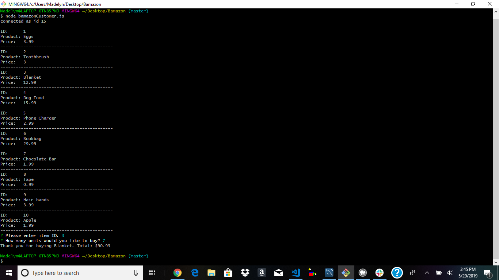

# Bamazon
Create database using mySQL.
Allow customer to view available items for sale including product id, name, and price.
Once customer is able to view full list of items, they are prompted to choose an item number. 
Next, the customer is prompted to choose the quantity of the item they would like to purchase.
Once both are answered, console will display a message stating item is out of stock or it will show total cost.

